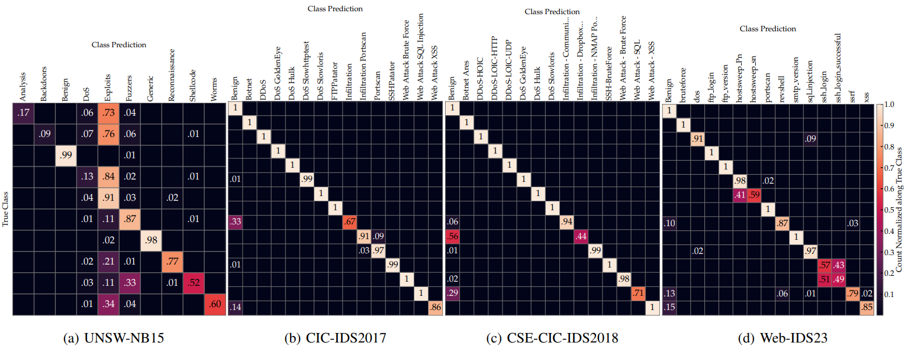
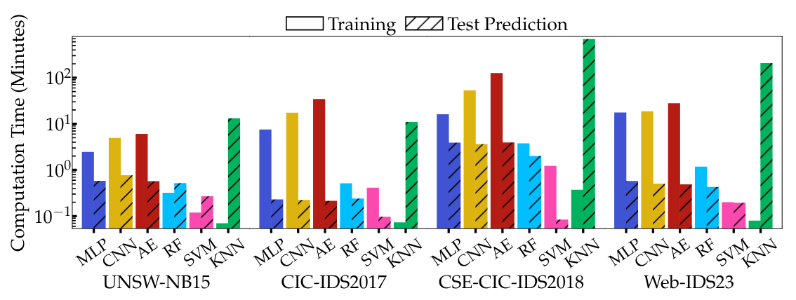

# Classification Report

## Datasets

| Dataset | Year | # Samples | Attack Classes | Features |
|---------|------|-----------|----------------|----------|
| **UNSW-NB15** | 2015 | 2,540,044 | 9 (large number of attacks grouped into categories, e.g., DoS and Exploits) | 41 (Argus and Bro-IDs: flow‑, direction‑, time‑based metrics) |
| **CIC-IDS2017** (improved) | 2017 | 2,827,726 | 15 (Variety of attacks such as multiple DoS, brute force, and web exploits) | 82 (CICFlowmeter: bidirectional flow statistics on packets, bytes, timings) |
| **CSE-CIC-IDS2018** (improved) | 2018 | 64,561,010 | 14 (Similar attack set to CIC-IDS2017, employed on a larger scale) | 82 (CICFlowmeter) |
| **WEB-IDS23** | 2023 | 12,059,749 | 21 (Comprehensive set of attacks, especially web-based exploits) | 82 (Zeek FlowMeter: similar set to CICFlowMeter) |

## Data Processing

We apply several data processing steps to prepare datasets for classification:

### Data Cleaning
- Remove timestamps and address-related features (IP addresses, port numbers) to prevent shortcut learning
- Eliminate constant features, duplicate features, and samples with missing/infinite/negative values
- Filter out classes with fewer than 13 samples (insufficient for oversampling)

### Class Balancing
- Address extreme class imbalance (benign records comprise up to 95% of datasets)
- Apply random fixed-ratio undersampling to classes exceeding 5% of the dataset
- Use SMOTE to oversample extremely imbalanced classes (1000:1 ratio or higher)
- Apply balancing techniques only to training data, evaluate on unmodified validation splits

### Feature Selection and Encoding
- Reduce feature count to prevent overfitting and improve explainability
- Remove highly correlated features using dataset-specific thresholds:
    - UNSW-NB15: 0.6 threshold (21 features remaining)
    - CIC-IDS2017: 0.5 threshold (29 features remaining)
    - CSE-CIC-IDS2018: 0.8 threshold (43 features remaining)
    - WEB-IDS23: 0.8 threshold (30 features remaining)
- One-hot encode categorical features
- Normalize numeric features using either min-max or quantile normalization based on hyperparameter selection

## Classifiers

We employ six different ML algorithms, representing a variety of techniques from deep learning to traditional ML approaches commonly used in network intrusion detection:

**Multi-Layer Perceptron (MLP)**
- Architecture: Multiple fully connected layers with ReLU activation and softmax output
- Configuration: 1-3 hidden layers (256, 256-128, or 256-128-64 nodes)
- Training: Adam optimizer with early stopping after 10 epochs without improvement

**Convolutional Neural Network (CNN)**
- Architecture: 1-3 1D convolutional blocks (32, 32-64, or 32-64-64 filters)
- Components: Each block contains convolution layer (kernel size 3-5) + max pooling (size 2)
- Post-processing: Output flattened to fully connected layers with dropout (0-0.5 rate)
- Activation: ReLU for intermediate layers, softmax for output layer
- Training: Adam optimizer with early stopping after 10 epochs without improvement

**Autoencoder (AE)**
- Unsupervised encoder-decoder pattern to produce lower-dimensional representations
- Encoder: Variable hidden layers with ReLU activation
- Decoder: Mirrored structure with sigmoid activation in final layer
- Features: L1 norm activation penalty for sparse representations
- Loss function: Cosine similarity for handling sparse one-hot encoded inputs
- Classification: Latent representations fed to MLP classifier
- Training: Adam optimizer with early stopping after 10 epochs without improvement

**Random Forest (RF)**
- Ensemble method using multiple decision trees (15-150)
- Configuration: Maximum tree depth 5-30
- Split criteria: Gini impurity or Shannon information gain

**Support Vector Machine (SVM)**
- Approximated RBF kernel map with linear SVM training via stochastic gradient descent
- Parameters: Kernel gamma (0.001-10), C (0.01-10), optimized alpha (learning rate)
- Implementation: Multiple binary SVMs in one-vs-rest configuration

**K-Nearest Neighbor (KNN)**
- Uses Euclidean distance metric
- Optimized k values: 2-15 (UNSW-NB15 and CIC-IDS2017)
- Default k=5 for larger datasets (CSE-CIC-IDS2018 and WEB-IDS23)

### Selected Hyperparameters using Randomized Search

| Classifier | Parameter                  | UNSW-NB15       | CIC-IDS2017     | CSE-CIC-IDS2018 | WEB-IDS23       |
|------------|----------------------------|-----------------|-----------------|-----------------|-----------------|
| **MLP**    | Normalization              | min-max         | quantile        | min-max         | quantile        |
|            | Hidden layer sizes         | 256, 128, 64    | 256, 128, 64    | 256, 128        | 256, 128, 64    |
|            | Learning rate              | 0.001749        | 0.0001          | 0.000373        | 0.000254        |
| **CNN**    | Normalization              | quantile        | min-max         | min-max         | min-max         |
|            | Dropout                    | 0.279164        | 0.158049        | 0.002158        | 0.293439        |
|            | Filter sizes               | 32, 64          | 32, 64, 64      | 32, 64          | 32, 64, 64      |
|            | Hidden layer sizes         | 256, 128        | 256             | 256, 128        | 256             |
|            | Kernel size                | 5               | 3               | 3               | 5               |
|            | Learning rate              | 0.000148        | 0.000107        | 0.000131        | 0.000162        |
| **AE**     | Normalization              | quantile        | quantile        | quantile        | quantile        |
|            | Encoder hidden layer sizes | 256             | 256, 128, 64    | 256, 128, 64    | 256             |
|            | L1 activation penalty      | 0.001106        | 0.00012         | 0.000257        | 0.000208        |
|            | Latent size ratio to input | 75.67%          | 31.27%          | 59.37%          | 75.55%          |
|            | AE learning rate           | 0.000509        | 0.002469        | 0.000476        | 0.000612        |
|            | MLP hidden layer sizes     | 256, 128, 64    | 256             | 256, 128, 64    | 256             |
|            | MLP learning rate          | 0.000588        | 0.000371        | 0.000172        | 0.000817        |
| **RF**     | Normalization              | quantile        | quantile        | min-max         | quantile        |
|            | Criterion                  | entropy         | gini            | entropy         | entropy         |
|            | Maximum depth              | 29              | 26              | 28              | 20              |
|            | Number of trees            | 146             | 104             | 106             | 135             |
| **SVM**    | Normalization              | quantile        | quantile        | quantile        | quantile        |
|            | Kernel gamma               | 1               | 0.1             | 0.1             | 0.1             |
|            | Kernel C                   | 10              | 10              | 0.1             | 0.1             |
|            | Alpha learning rate        | 0.000032        | 0.000001        | 0.000002        | 0.000111        |
|            | Loss function              | modified huber  | modified huber  | modified huber  | hinge           |
| **KNN**    | Normalization              | min-max         | quantile        | min-max         | min-max         |
|            | Number of neighbors        | 5               | 3               | 5               | 5               |

## Evaluation Results

We evaluate all six classifier models across the four datasets using accuracy and macro-averaged F1 scores as key performance metrics.

### Accuracy and Macro-Averaged F1 Score of Classifiers on Test Data

| Dataset | MLP |  | CNN |  | AE |  | RF |  | SVM |  | KNN |  |
|---------|-----|-----|-----|-----|-----|-----|-----|-----|-----|-----|-----|-----|
|  | Acc. | F1 | Acc. | F1 | Acc. | F1 | Acc. | F1 | Acc. | F1 | Acc. | F1 |
| **UNSW-NB15** | **0.974** | 0.537 | 0.973 | 0.544 | 0.973 | 0.527 | **0.974** | **0.569** | 0.957 | 0.452 | 0.973 | 0.554 |
| **CIC-IDS2017** | **0.995** | 0.887 | **0.995** | 0.912 | 0.994 | 0.902 | **0.995** | **0.972** | 0.975 | 0.604 | 0.994 | 0.938 |
| **CSE-CIC-IDS2018** | **1.0** | 0.827 | **1.0** | 0.855 | **1.0** | 0.842 | **1.0** | **0.947** | 0.994 | 0.663 | **1.0** | 0.835 |
| **WEB-IDS23** | 0.987 | 0.856 | 0.987 | 0.847 | 0.987 | 0.865 | **0.988** | **0.885** | 0.976 | 0.62 | **0.988** | 0.873 |

### Confusion Matrices of RF Models on Test Data

### Computational Performance

We evaluate computational requirements for each classifier to assess practical deployment feasibility:

- **Deep Learning Models**: Longest training times across all datasets
- **SVMs**: Lowest resource requirements but poorest classification performance
- **KNNs**: Good classification results but impractically high prediction costs for large datasets
- **Random Forests**: Best balance of high classification scores and computational efficiency

#### Training and Testing Time of Classifiers for Each Dataset

